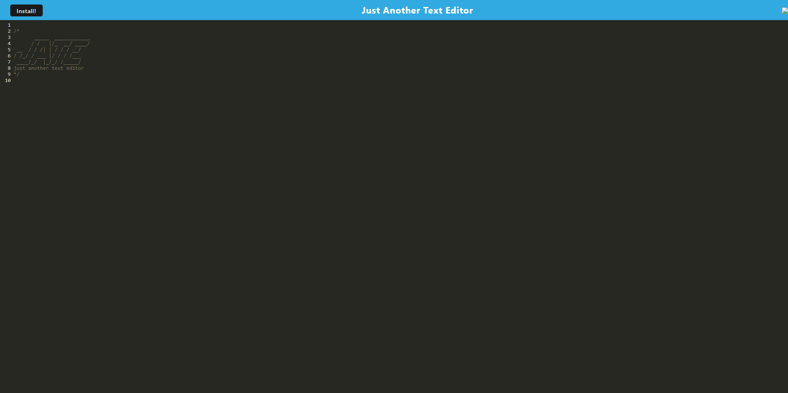

# Jate


## Table of Contents  
* [Description](##Description)  
* [Getting Started](##Setting)  
* [Screenshot](##Screenshot)  
* [Installation](##Installation)  
* [License](##License)  
* [Contact](##Contact)  

## Description

This web application is a text editior that allows a user to write what they need, save it, and download it to their computer. You can also install Jate on your device to allow use for both online and offline.

## Getting Started

To get started, clone the repo, install the NPM packages and start the application. 

## Deployed Application

The deployed application is at https://service-worker-bootcamp.herokuapp.com/

## Installation

1. Clone the repo
   ```sh
   https://github.com/hoeferg/textEditor
   ```
2. Install NPM packages
   ```sh
   npm install
   ```
3. Start the application
   ```sh
   npm start


## License

No license

---

## Contact
Gayle Hoefer - [LinkedIn](https://www.linkedin.com/in/gayle-hoefer-61a2a3124/) - [Github](https://github.com/hoeferg)

Project Link: [https://service-worker-bootcamp.herokuapp.com/](https://github.com/hoeferg/textEditor)
